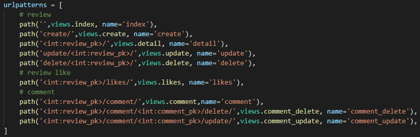

# 관통 프로젝트

**📆 2021.11.17~25**

**초기 셋팅 명령어**

```bash
# 가상환경 생성
python -m venv venv
# 가상환경 켜기
source venv/Scripts/activate
# requirements.txt 설치
pip install -r requirements.txt
# migrate
python manage.py migrate
# DB loaddata
python manage.py loaddata genres.json
python manage.py loaddata movies.json
python manage.py loaddata movie_genres.json
# runserver
python manage.py runserver
```

### 1. 팀원 정보 및 업무 분담 내역

**👧🏻 박해인**

* 아이디어 구상 및 모델 컴포넌트 구조 구성
* 초기 FE 담당
* 데이터 베이스 구축
* 사용자 경험을 우선으로 한 디자인 작업
* 오류 수정

**👩🏻 이가은**

* 아이디어 구상 및 모델 컴포넌트 구조 구성
* 초반 BE 담당
* 추가 기능 구현
* 알고리즘 구현
* 오류 수정


### 2. 목표

* 영화 정보 기반 추천 서비스 구성
* 커뮤니티 서비스 구성
* HTML, CSS, JavaScript, Vue.js, Django, REST API, DataBase 등을 활용한 실제 서비스 설계
* 서비스 관리 및 유지보수


### 3. 개발환경

#### A. 언어

i. Python 3.8+

ii. Django 3.x

#### B. 도구

i. VSCode

ii. Chrome Browser

#### C. 아키텍처

Django & Vanilla JS


### 4. 프로젝트 구조


accounts, community, movies 3개의 앱으로 구성되어 있습니다.

### 5. 목표 서비스 구현 및 실제 구현 정도

- [x] 주어진 명세 구현

  - 관리자 뷰

  - 영화 정보 50개 이상
  - 로그인 유저가 영화에 대한 평점 등록, 수정, 삭제 접근 가능
  - 추천 알고리즘 구현
  - 커뮤니티 기능 구현
  - 로그인 한 사용자만 글을 조회, 생성 가능
  - 작성자 본인만 댓글을 삭제 가능
  - 각 게시글 및 댓글 생성 및 수정 시각 정보 포함
  - 최소한 5개 이상의 URL 및 페이지 구상

- [x] 디자인 적용

- [x] 검색 기능 구현

- [x] static 활용

- [ ] 카카오, 구글 로그인

- [ ] 프로필에 이미지 추가

- [ ] 별점을 숫자가 아닌 별 이미지로 구현


### 6. 데이터베이스 모델링 (ERD)


### 7. 필수 기능에 대한 설명

#### A. 영화 커뮤니티


#### B. 영화 추천

사용자는 **<u>랜덤, 장르, 팔로우한 유저가 좋아하는 영화</u>** 이 세 가지 방식으로 영화를 추천받을 수 있습니다.

**첫째,** 무작위로 추천받을 수 있습니다. 초기화면(movies/index.html)에서 버튼 클릭을 통해 인기작을 기본적으로 4개의 영화를 추천받습니다. 원한다면 하단의 버튼을 클릭해 4개씩 더 추천받을 수 있습니다.


**둘째,** 크리스마스에 당신은? 이라는 질문을 기반으로한 추천을 받을 수 있습니다. 혼자서 보낸다면 코미디를, 연인과 보낸다면 로맨스, 친구와 보낸다면 SF, 가족끼리 보낸다면 가족영화를 추천받습니다.

> ✔. 곧 올 크리스마스 때 사용자의 선택에 따른 영화 추천 알고리즘을 구현


**셋째,** 유저가 팔로우한 사용자가 좋아요한 영화를 추천받을 수 있습니다. 

> ✔.  Model 관계에 대한 이해도와 정확한 적용을 확인하기 위해 User가 좋아요 한 영화, User가 좋아요 한 다른 User의 관계를 활용. 내가 팔로우 하고 있는 User가 좋아요를 누른 Movie를 갖고오는 알고리즘. 이때, 내가 팔로우 하고 있는 두 명 이상의 사용자가 좋아하는 영화가 겹칠 시 한 번만 보여주도록 알고리즘 구현
> ✔. User가 Follow 하고 있지 않은 경우 Community로, Follow하고 있는 User가 있지만 그 User가 좋아요 누른 영화가 없다면 Movie를 탐색하는 페이지로 이동

💻 사진 1: 유저가 추천받은 영화


💻 사진 2 : 유저가 팔로우한 사용자 kakao가 좋아하는 영화


### 8. 기타 요구사항

#### A. 관리자 뷰

> 관리자 권한의 유저만 영화 등록/수정/삭제 권한을 가집니다.
>
> 관리자 권한의 유저만 유저 관리 권한을 가집니다.
>
> 장고에서 기본적으로 제공하는 admin 기능을 이용하여 구현합니다


#### B. 영화 정보

> 영화 정보는 Database Seeding을 활용하여 최소 50개 이상의 데이터가 존재하도록 구성해야 합니다.
>
> 모든 로그인 된 유저는 영화에 대한 평점 등록/수정/삭제 등을 할 수 있어야 합니다.


TMDB API를 이용해 인기있는(popular) 영화 리스트에서 280개의 영화 정보를 추출하여 json 파일로 저장하였습니다.

**📌 movies/models.py**


유저는 커뮤니티를 이용하여 영화에 대한 평점을 등록, 수정, 삭제할 수 있습니다. 영화에 대한 평점은 1~10점까지 입력할 수 있습니다.

**📌community/views.py**


**📌 community/models.py**


#### C. 추천 알고리즘

> 평점을 등록한 유저는 해당 정보를 기반으로 영화를 추천 받을 수 있어야 합니다.
>
> 추천 알고리즘의 지정된 형식은 없으나, 사용자는 반드시 최소 1개 이상의 방식으로 영화를 추천 받을 수 있어야 합니다.
>
> 추천 방식은 각 팀별로 자유롭게 선택할 수 있으며 어떠한 방식으로 추천 시스템을 구성했는지 설명할 수 있어야 합니다.

(상단 기재)


#### D. 커뮤니티

> 영화 정보와 관련된 대화를 할 수 있는 커뮤니티 기능을 구현해야 합니다.
>
> 로그인한 사용자만 글을 조회/생성할 수 있으며 작성자 본인만 글을 수정/삭제 할 수 있습니다.
>
> 사용자는 작성된 게시글에 댓글을 작성할 수 있어야 하며, 작성자 본인만 댓글을 삭제할 수 있습니다
>
> 각 게시글 및 댓글은 생성 및 수정 시각 정보가 포함되어야 합니다

(상단 기재)


#### E. 기타

> 최소한 5개 이상의 URL 및 페이지를 구성해야 합니다.


**📌 app/urls.py**


**📌 accounts/urls.py**


**📌 community/urls.py**



**📌 movies/urls.py**


### 9. 배포 서버 URL

수정 후 배포 예정


### 10. 기타 (느낀 점)

​	➕ 처음의 계획에는 Django와 Vue를 이용하여 프로젝트를 진행하다가 Vue에 대한 이해도가 부족한 상태에서 계속 진행하는 것은 무리라고 판단하여, Django로 프로젝트를 실행하였다. 오랜만에 Django를 접하게 되면서 Django에 대한 이해도가 상승할 수 있었다.

​	➕ 페어와 프로젝트를 시작하면서 역할 분담 및 서로 걱정되는 부분에 대하여 이야기하게 되었다. 각자가 걱정하는 부분이 있었고, 그 부분에 대하여 프로젝트 시작하면서 이야기함으로 원활하게 소통할 수 있었던 것 같다.

​	➕ 서버 구현은 1-2일에 큰 틀은 완성할 수 있었다. 하지만, 약간씩의 오류와 옳지 않은 url로 가는 경우가 발생하였으며, 이를 계속해서 수정해나갔다.

​	➕ Django와 VanilaJS로 구현하는 것은 디자인에 한계가 있음을 느낄 수 있었다. 방학 기간동안에 Vue 공부를 열심히 해야겠다고 느꼈다.