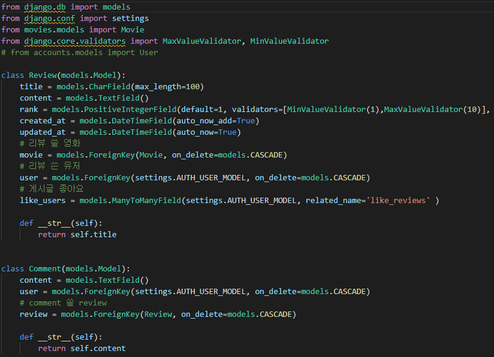

# 관통 프로젝트

**📆 2021.11.17~25**

### 1. 목표

* 영화 정보 기반 추천 서비스 구성
* 커뮤니티 서비스 구성
* HTML, CSS, JavaScript, Vue.js, Django, REST API, DataBase 등을 활용한 실제 서비스 설계
* 서비스 관리 및 유지보수

### 2. 개발환경

#### A. 언어

i. Python 3.8+

ii. Django 3.x

#### B. 도구

i. VSCode

ii. Chrome Browser

#### C. 아키텍처

Django & Vanilla JS

### 3. 서비스 개요

#### A. 프로젝트 구조

accounts, community, movies 3개의 앱으로 구성되어 있습니다.

#### B. 영화 커뮤니티

#### C. 영화 추천

사용자는 **<u>랜덤, 장르, 팔로우한 유저가 좋아하는 영화</u>** 이 세 가지 방식으로 영화를 추천받을 수 있습니다.

첫째, 무작위로 추천받을 수 있습니다. 초기화면(movies/index.html)에서 버튼 클릭을 통해 인기작을 기본적으로 4개의 영화를 추천받습니다. 원한다면 하단의 버튼을 클릭해 4개씩 더 추천받을 수 있습니다.

둘째, 크리스마스에 당신은? 이라는 질문을 기반으로한 추천을 받을 수 있습니다. 혼자서 보낸다면 코미디를, 연인과 보낸다면 로맨스, 친구와 보낸다면 SF, 가족끼리 보낸다면 가족영화를 추천받습니다.

셋째, 유저가 팔로우한 사용자가 좋아요한 영화를 추천받을 수 있습니다. 

💻 사진 1: 유저가 추천받은 영화

💻 사진 2 : 유저가 팔로우한 사용자 bobo가 좋아하는 영화

### 4. 요구사항

#### A. 관리자 뷰

> 관리자 권한의 유저만 영화 등록/수정/삭제 권한을 가집니다.
>
> 관리자 권한의 유저만 유저 관리 권한을 가집니다.
>
> 장고에서 기본적으로 제공하는 admin 기능을 이용하여 구현합니다

#### B. 영화 정보

> 영화 정보는 Database Seeding을 활용하여 최소 50개 이상의 데이터가 존재하도록 구성해야 합니다.
>
> 모든 로그인 된 유저는 영화에 대한 평점 등록/수정/삭제 등을 할 수 있어야 합니다.

TMDB API를 이용해 인기있는(popular) 영화 리스트에서 280개의 영화 정보를 추출하여 json 파일로 저장하였습니다.

**📌 movies/models.py**

유저는 커뮤니티를 이용하여 영화에 대한 평점을 등록, 수정, 삭제할 수 있습니다. 영화에 대한 평점은 1~10점까지 입력할 수 있습니다.

**📌community/views.py**

**📌 community/models.py**

i. 팀원 정보 및 업무 분담 내역

ii. 목표 서비스 구현 및 실제 구현 정도

iii. 데이터베이스 모델링 (ERD)

iv. 필수 기능에 대한 설명

v. 배포 서버 URL

vi. 기타 (느낀 점)